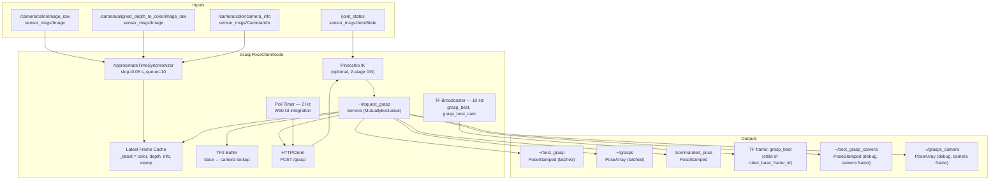
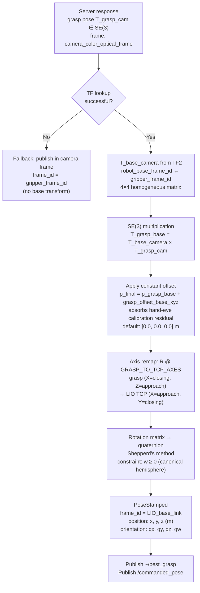
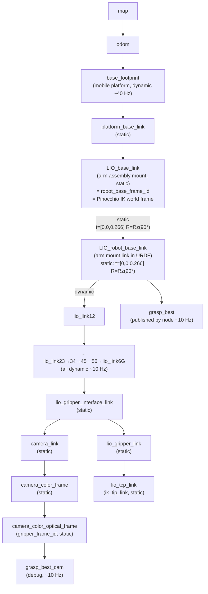
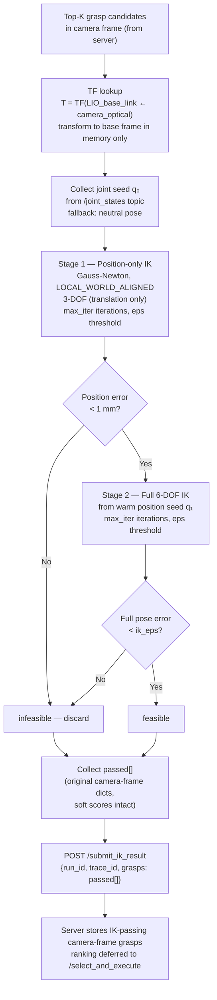
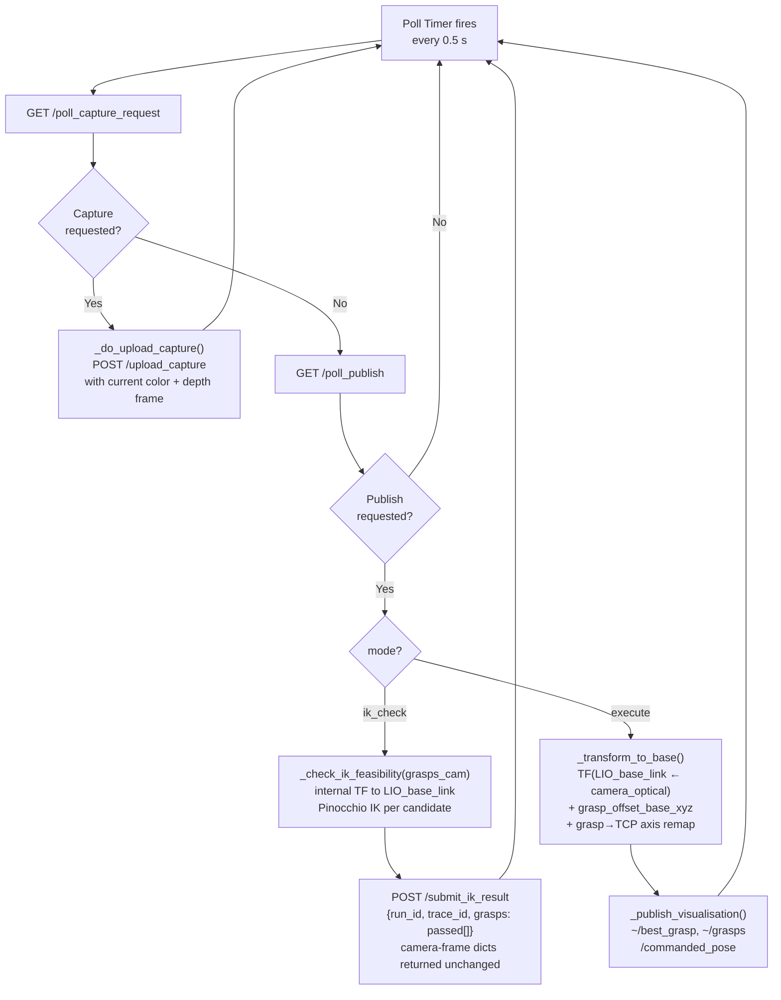
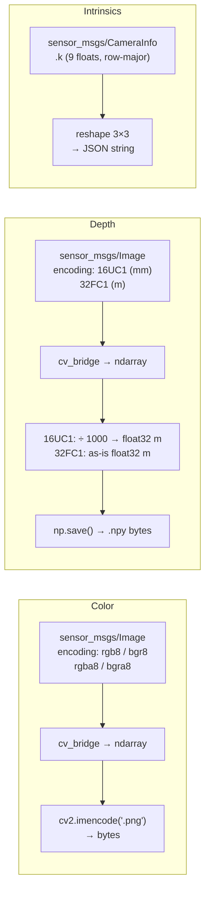
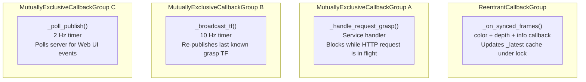

# grasp_pose_client — Architecture & Data Flow

## Overview

`grasp_pose_client` is a ROS 2 node that bridges the robot and a remote VLM-based grasp server. It synchronises color, depth, and camera-info streams from a RealSense camera, encodes them, and POSTs them to an HTTP server that returns ranked 6-DOF grasp poses. The node transforms those poses from the camera optical frame into the robot base frame using TF2, optionally validates each candidate with a Pinocchio-based IK solver, and publishes the best pose to `/commanded_pose` for downstream execution. It also integrates with the server's Web UI via a 2 Hz polling loop.

**Key dependencies:** ROS 2 (rclpy, tf2, message_filters), OpenCV, NumPy, `requests`; Pinocchio is optional (enables IK filtering).

---

## 1. Node Architecture



---

## 2. Grasp Request — Sequence Diagram

This is the main path triggered when a caller invokes the `~/request_grasp` service.

```mermaid
sequenceDiagram
  participant Caller
  participant Node as GraspPoseClientNode
  participant TF as TF2 Buffer
  participant Server as Grasp HTTP Server
  participant IK as Pinocchio IK (optional)
  participant Pub as ROS Publishers

  Caller->>Node: ~/request_grasp {task_spec, top_k, num_candidates}

  Node->>Node: _take_snapshot()<br/>validate age < max_snapshot_age_s (2.0 s)

  Node->>Node: image_conversion:<br/>color → PNG bytes (cv2.imencode)<br/>depth → .npy float32 metres<br/>CameraInfo.K → 3×3 JSON

  Node->>TF: lookup_transform(robot_base_frame_id ← gripper_frame_id, stamp)
  TF-->>Node: T_base_camera (4×4) or None on timeout

  Node->>Server: POST /grasp {rgb.png, depth.npy, K, task_spec, top_k, ...}
  Server-->>Node: JSON {grasps[], scores[], widths[], run_id, frame_id}

  alt IK check enabled (ik_urdf_path set)
    Note over Node,IK: grasps are still in camera frame here
    Node->>IK: _check_ik_feasibility(grasps_cam, q_seed)<br/>internally: T_ik = TF(LIO_base_link ← camera_optical)<br/>p_ik = T_ik × T_grasp_cam  (in-memory only, not stored)
    IK-->>Node: passed_grasps[] (camera-frame dicts, unchanged)
    Node->>Server: POST /submit_ik_result {run_id, trace_id, grasps: passed[]}
    Note over Node,Server: server stores IK-passing camera-frame grasps;<br/>ranking happens later via /select_and_execute
  end

  Note over Node: execute path only — after /select_and_execute triggers mode=execute
  Node->>Node: _transform_to_base() for each grasp<br/>T_grasp_base = T_base_camera × T_grasp_cam<br/>+ grasp_offset_base_xyz

  Node->>Pub: ~/best_grasp  (grasps[0])
  Node->>Pub: ~/grasps       (all top-K)
  Node->>Pub: /commanded_pose (copy of grasps[0])
  Node->>Pub: ~/best_grasp_camera (debug — untransformed)
  Node->>Pub: ~/grasps_camera     (debug — untransformed)
  Node->>Node: _set_grasp_tfs() — stash for 10 Hz TF broadcaster

  Node-->>Caller: {success, grasps[], scores[], widths[], run_id, message}
```

---

## 3. Coordinate Transformation Pipeline

Grasp poses leave the server expressed in the camera optical frame. This section shows how they arrive in the robot base frame.



### Coordinate conventions

| Symbol | Meaning |
|--------|---------|
| `T_base_camera` | 4×4 rigid transform: points in camera frame → robot base frame |
| `T_grasp_cam` | 4×4 pose of gripper in camera frame (from server) |
| `T_grasp_base` | 4×4 pose of gripper in robot base frame (after transform) |
| `grasp_offset_base_xyz` | Constant position correction in base frame (metres) |
| Quaternion order | `(x, y, z, w)` in all ROS messages |
| Pinocchio internal | `(w, x, y, z)` — conversion applied before/after IK calls |

---

## 4. TF Frame Tree

Complete tree as observed at runtime (`ros2 run tf2_tools view_frames`):



### Frame roles

| Frame | Role | Used by |
|---|---|---|
| `LIO_base_link` | Arm assembly mounting point on platform; root link of `lio_arm_reframed.urdf`; Pinocchio world frame | Output frame for `/commanded_pose` (`robot_base_frame_id`); IK TF lookup target (`ik_base_link`) |
| `LIO_robot_base_link` | Parent of `lio_link12` in full robot TF tree; **not present in the IK URDF**; 266 mm above + 90° from `LIO_base_link` | TF chain intermediate only (no longer used as an output frame) |
| `camera_color_optical_frame` | RealSense color sensor optical frame; all grasp poses are stored in this frame | TF lookup source; `gripper_frame_id` |

The two base frames are **not interchangeable**: they differ by a static transform of `t = [0, 0, 0.266] m`, `R = Rz(90°)`. All published commands and the IK check now use `LIO_base_link` (`robot_base_frame_id` = `ik_base_link` = `LIO_base_link`); `LIO_robot_base_link` only appears as an intermediate link inside the full-robot TF tree.

The static transform from `lio_gripper_interface_link` → `camera_link` is published by the production launch file ([grasp_pose_client.launch.py](../launch/grasp_pose_client.launch.py)) via a `StaticTransformBroadcaster`. Its rotation places the RealSense optical axis pointing forward along the robot's approach direction.

---

## 5. IK Feasibility Check

Enabled by setting the `ik_urdf_path` parameter. Uses Pinocchio's Gauss-Newton solver in two stages to avoid local minima.



### URDF used for IK

The launch file configures `ik_urdf_path` to `lio_arm_reframed.urdf` (from the `panda_ik` package). This is a **trimmed arm-only URDF** whose Pinocchio frame list is:

```
universe → LIO_base_link → lio_joint1 → lio_link12 → ... → lio_tcp_link
```

`LIO_robot_base_link` is **not present** in this URDF. The Pinocchio world frame is `LIO_base_link`, so the TF lookup target `ik_base_link = "LIO_base_link"` is correct — the IK target SE3 expressed in `LIO_base_link` is interpreted directly as the Pinocchio world-frame target without any additional offset.

**Key parameters:**

| Parameter | Default | Deployed value | Role |
|-----------|---------|----------------|------|
| `ik_urdf_path` | `""` | `<panda_ik>/urdfs/lio_arm_reframed.urdf` | Path to robot URDF; empty disables IK |
| `ik_base_link` | `LIO_base_link` | `LIO_base_link` | Root link of IK URDF = Pinocchio world frame |
| `ik_tip_link` | `lio_tcp_link` | `lio_tcp_link` | End-effector link in URDF |
| `ik_max_iter` | `200` | `200` | Max Gauss-Newton iterations per stage |
| `ik_eps` | `1e-4` | `1e-4` | Convergence threshold (m / rad) |
| `ik_dt` | `0.1` | `0.1` | Newton step size |
| `ik_damp` | `1e-6` | `1e-6` | Damping factor for (J Jᵀ + λI)⁻¹ |

---

## 6. Web UI Poll Loop

A 0.5 s timer polls two server endpoints so the Web UI can trigger captures and publish grasp results without a direct ROS service call.



---

## 7. Image Encoding

Handled by [image_conversion.py](../grasp_pose_client/image_conversion.py).



---

## 8. ROS 2 Callback Concurrency Model



The sync callback uses a `ReentrantCallbackGroup` so that new frames can arrive and update `_latest` even while an HTTP request is blocked inside `_handle_request_grasp`. The service handler uses a `MutuallyExclusiveCallbackGroup` to ensure only one in-flight request at a time, matching the server-side lock.

---

## 9. Key Parameters Reference

| Parameter | Default | Description |
|-----------|---------|-------------|
| `server_url` | `http://localhost:8765` | Grasp server base URL |
| `color_topic` | `/camera/camera/color/image_raw` | Color image subscription |
| `depth_topic` | `/camera/camera/aligned_depth_to_color/image_raw` | Aligned depth subscription |
| `camera_info_topic` | `/camera/camera/color/camera_info` | Camera intrinsics |
| `sync_queue_size` | `10` | ApproximateTimeSynchronizer queue depth |
| `sync_slop_s` | `0.05` | Color/depth time sync tolerance (s) |
| `gripper_frame_id` | `camera_color_optical_frame` | TF source frame (grasps from server) |
| `robot_base_frame_id` | `LIO_base_link` | TF target frame (published poses) |
| `tf_timeout_s` | `0.2` | TF lookup timeout (s) |
| `grasp_offset_base_xyz` | `[0.0, 0.0, 0.0]` | Extrinsic bias correction in base frame (m) |
| `max_snapshot_age_s` | `2.0` | Reject frames older than this (s) |
| `request_timeout_s` | `60.0` | HTTP POST timeout (s) |
| `default_top_k` | `1` | Default number of grasp candidates to return |
| `default_num_candidates` | `1` | Default VLM proposal count |
| `ik_urdf_path` | `""` | Path to URDF for IK; empty = IK disabled |
| `ik_base_link` | `LIO_base_link` | URDF root link for IK |
| `ik_tip_link` | `lio_tcp_link` | URDF end-effector link for IK |
| `joint_states_topic` | `/joint_states` | Joint state topic for IK seed |
| `probe_health_on_startup` | `true` | Call `/health` on server at node startup |
